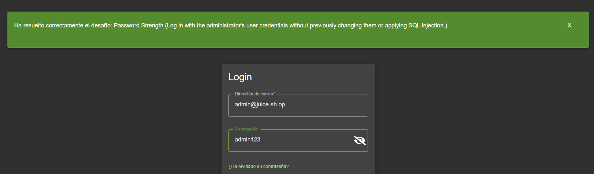

# Detección y Documentación de Vulnerabilidades Web en Aplicaciones Extremadamente Vulnerables

## RETO 1: LOGIN VULNERADO: Bypassing del usuario administrador

### Descripción técnica:
En el login, tenemos una vulnerabilidad por inyección mysqli. 
- SELECT * FROM Users WHERE email = '' OR 1=1--' AND password = '...'

### Cómo la encontré:
La encontré intentando funciones de inyección de código básicas. "_' OR 1=1--_"

### Impacto potencial:
Muy alto, ya que cualquiera con mínimos conocimientos podría entrar y empezar a modificar cosas.

### Soluciones: 
Securizaremos las consultas encapsulándolas y preparándolas previamente de insertarlas a pelo en el código.

### Pruebas físicas: 

## RETO 2: CONTRASEÑA DÉBIL: Contraseña por defecto

### Descripción técnica:
El usuario administrador tenía una contraseña insegura y fácil .

### Cómo la encontré:
Dentro de nuestras pruebas, en el login hemos intentado acceder con el usuario (email) por defecto de este usuario. Con contraseñas fáciles.

### Impacto potencial:
Sigue siendo muy alto

### Soluciones:
Cambiar la contraseña del usuario administrador por lo mínimo.

### Pruebas físicas: 
