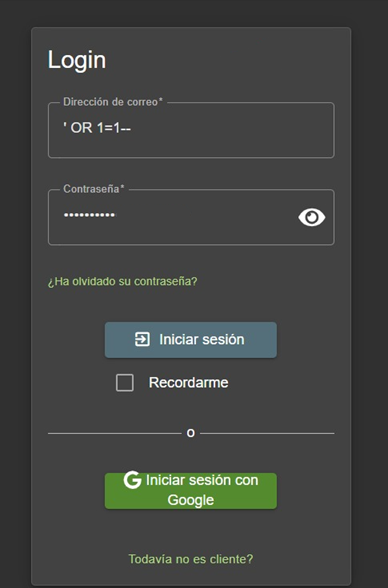

# Detección y Documentación de Vulnerabilidades Web en Aplicaciones Extremadamente Vulnerables

## RETO 1: LOGIN VULNERADO: Bypassing del usuario administrador

### Descripción técnica:
En el login, tenemos una vulnerabilidad por inyección mysqli. 
- SELECT * FROM Users WHERE email = '' OR 1=1--' AND password = '...'

### Cómo la encontré:
La encontré intentando funciones de inyección de código básicas. "_' OR 1=1--_"

### Impacto potencial:
Muy alto, ya que cualquiera con mínimos conocimientos podría entrar y empezar a modificar cosas.

### Pruebas físicas: 
Securizaremos las consultas encapsulándolas y preparándolas previamente de insertarlas a pelo en el código.

### Pruebas físicas: 
